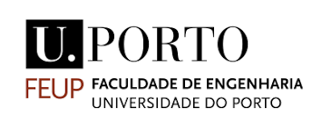
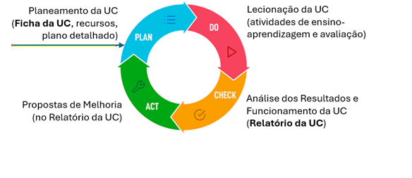

  

# Proposta de Manual de Boas Práticas do Docente da FEUP

**Versão 0.10** · FEUP, 14 de abril de 2026

## Resumo

Este documento, dirigido ao corpo docente da FEUP, pretende servir de apoio à gestão das unidades curriculares (UC) e da atividade docente. Está organizado por subprocessos, com listas de verificação (*checklist*) dentro de cada subprocesso e apontadores para informação adicional, tendo em conta as boas práticas pedagógicas e os regulamentos e normas em vigor. Pode ser adaptado às necessidades de cada ciclo de estudos (CE) ou UC. Pode ainda ser usado para efeitos de auditoria manual ou assistida por ferramentas de inteligência artificial (IA) generativa. Uma vez que o objetivo é funcionar como lista de verificação, foca-se principalmente nas ações e boas práticas que devem ser seguidas e não tanto na forma da sua implementação.

## Conteúdo

- [1 Introdução](#1-introducao)
  - [1.1 Enquadramento e objetivos](#11-enquadramento-e-objetivos)
  - [1.2 Acrónimos](#12-acronimos)
  - [1.3 Referências](#13-referencias)
  - [1.4 Princípios orientadores](#14-principios-orientadores)
  - [1.5 Organização](#15-organizacao)
- [2 Arranque de Unidade Curricular](#2-arranque-de-unidade-curricular)
  - [2.1 Ficha da unidade curricular](#21-ficha-da-unidade-curricular)
  - [2.2 Recursos pedagógicos](#22-recursos-pedagogicos)
  - [2.3 Planeamento detalhado](#23-planeamento-detalhado)
- [3 Funcionamento Semanal](#3-funcionamento-semanal)
  - [3.1 Conteúdos](#31-conteudos)
  - [3.2 Aulas](#32-aulas)
  - [3.3 Assiduidade](#33-assiduidade)
  - [3.4 Atendimento](#34-atendimento)
  - [3.5 Comunicação, coordenação e monitorização](#35-comunicacao-coordenacao-e-monitorizacao)
  - [3.6 Estudantes com necessidades ou dificuldades específicas](#36-estudantes-com-necessidades-ou-dificuldades-especificas)
- [4 Elementos de Avaliação](#4-elementos-de-avaliacao)
  - [4.1 Enunciados](#41-enunciados)
  - [4.2 Logística](#42-logistica)
  - [4.3 Integridade](#43-integridade)
  - [4.4 Resultados](#44-resultados)
  - [4.5 Faltas](#45-faltas)
- [5 Fecho de Unidade Curricular](#5-fecho-de-unidade-curricular)
  - [5.1 Verificações finais](#51-verificacoes-finais)
  - [5.2 Relatório da unidade curricular](#52-relatorio-da-unidade-curricular)
- [Anexo A – Exemplo de Ficha de Unidade Curricular](#anexo-a-exemplo-de-ficha-de-unidade-curricular)
- [Anexo B – Exemplo de Rubrica de Avaliação](#anexo-b-exemplo-de-rubrica-de-avaliacao)
- [Anexo C – Medidas de Implementação](#anexo-c-medidas-de-implementacao)

---

# 1 Introdução {#1-introducao}
## 1.1 Enquadramento e objetivos {#11-enquadramento-e-objetivos}
Para cumprir a sua missão de educação em consonância com a sua reputação a nível nacional e internacional, a FEUP enfrenta presentemente diversos desafios:

- desafios de escala - acolhe dos maiores cursos de engenharia do país, colocando elevada pressão a nível de recursos físicos e humanos e metodologias de ensino-aprendizagem, avaliação e gestão para atingir qualidade em escala;

- volatilidade do corpo docente – recorre a número significativo de docentes convidados por períodos relativamente curtos;

- internacionalização – acolhe um número crescentes de estudantes internacionais e de mobilidade;

- dispersão de informação – a informação relevante para o corpo docente encontra-se dispersa por diversos regulamentos, diretivas e outros documentos, da FEUP, da U.Porto ou de âmbito nacional;

- transformação digital – o rápido avanço das tecnologias digitais, como a inteligência artificial (IA) generativa, e a emergência de modelos alternativos de ensino-aprendizagem sustentados em plataformas digitais originam desafios e oportunidades ao nível da atualização das práticas pedagógicas, da integração eficaz de novas ferramentas, da diferenciação do ensino presencial e da redefinição do papel do docente enquanto agente ativo na mediação da aprendizagem.

O objetivo deste documento é precisamente o de compilar, na forma de listas de verificação (*checklists*), um conjunto de informação relevante e recomendações, para apoiar os regentes e docentes nas suas atividades de gestão e lecionação de unidades curriculares e ajudar a enfrentar com sucesso os desafios mencionados, seguindo princípios de melhoria contínua, investimento no planeamento, colaboração entre pares e orientação a resultados.

## 1.2 Acrónimos {#12-acronimos}
Ao longo do documento são utilizados os acrónimos indicados na tabela seguinte.

| CA   | Comissão de Acompanhamento (do CE)                |
|------|---------------------------------------------------|
| CC   | Comissão Científica (do CE)                       |
| CE   | Ciclo de Estudos                                  |
| CNA  | Concurso Nacional de Acesso                       |
| CP   | Conselho Pedagógico (da FEUP)                     |
| DCE  | Diretor do Ciclo de Estudos                       |
| ENEE | Estudante com Necessidades Educativas Específicas |
| FEUP | Faculdade de Engenharia da Universidade do Porto  |
| IA   | Inteligência Artificial                           |
| IP   | Inquéritos Pedagógicos                            |
| GOI  | Gabinete de Orientação e Integração               |
| SGQ  | Sistema de Gestão da Qualidade                    |
| UC   | Unidade Curricular                                |
| UO   | Unidade Orgânica (por exemplo, FEUP)              |
| UP   | Universidade do Porto                             |

## 1.3 Referências {#13-referencias}
Este documento procura compilar e basear-se em elementos dispersos pelas referências a seguir listadas.

1.  [Regulamento específico de avaliação de discentes da FEUP](https://sigarra.up.pt/feup/pt/web_gessi_docs.download_file?p_name=F2118070764/Reg_Espec_Aval_Disc_FEUP.pdf), 18/7/2018

2.  [Calendário escolar da FEUP](https://sigarra.up.pt/feup/pt/web_base.gera_pagina?p_pagina=calend%c3%a1rio%20escolar)

3.  [Manual do Sistema de Gestão da Qualidade da Universidade do Porto (SGQ.UP)](https://sigarra.up.pt/up/pt/web_base.gera_pagina?p_pagina=sistema%20de%20gest%c3%a3o%20da%20qualidade%20da%20universidade%20do%20porto) Versão de 2023.

4.  [Despacho n.º GR. 03/09/2009](https://sigarra.up.pt/up/pt/LEGISLACAO_GERAL.ver_legislacao?p_nr=4148) - Diretiva para a disponibilização de informação científico-pedagógica e sumários de aulas relativas às unidades curriculares dos ciclos de estudos da Universidade do Porto

5.  [Regulamento disciplinar dos estudantes da U.Porto (Despacho n.° GR.031071201 1)](https://sigarra.up.pt/feup/pt/web_gessi_docs.download_file?p_name=F-684168888/GR_03_07_2011_Regulamento_Disciplinar_Estudantes.pdf)

6.  [Regulamento geral para avaliação dos discentes de primeiros ciclos, de ciclos de estudos integrados de mestrado e de segundos ciclos da Universidade do Porto (Despacho n.º GR.04/01/2018)](https://sigarra.up.pt/feup/pt/web_gessi_docs.download_file?p_name=F866897642/Regulamento_de_avaliacao_de_discentes_UP_-_2018.19.pdf)

7.  [Código de Ética da Universidade do Porto (Despacho n.º 1156/2026)](https://sigarra.up.pt/up/pt/legislacao_GERAL.ver_legislacao?p_nr=52473)

8.  [Estatuto da carreira docente universitária (ECDU), versão consolidada](https://fne.pt/uploads/documentos/1433262954_9365_ECDU_versao_consolidada.pdf)

9.  [Glossário Académico da Universidade do Porto](https://sigarra.up.pt/up/pt/web_base.gera_pagina?p_pagina=gloss%c3%a1rio%20acad%c3%a9mico%20da%20universidade%20do%20porto)

## 1.4 Princípios orientadores {#14-principios-orientadores}
A seleção de boas práticas neste documento é guiada por quatro princípios orientadores.

**Melhoria contínua**

Foco em ciclos [PDCA](https://en.wikipedia.org/wiki/PDCA) (PLAN-DO-CHECK-ACT/ADJUST) de melhoria contínua, aplicados em diferentes níveis de granularidade:

- ocorrências de UCs (foco principal neste documento);

- problemas e sugestões identificados pelas CA (foco de sistema de acompanhamento curricular que se encontra em implementação);

- edições anuais de CEs (foco dos planos e relatórios anuais de CE);

- versões de ciclos de estudos (foco das propostas de criação/alteração de CEs e relatórios de auto-avaliação para efeitos de acreditação pela A3ES).

A figura seguinte ilustra a aplicação do ciclo PDCA de melhora contínua ao nível das ocorrências de UCs, realçando a importância das fichas e relatórios das UCs, que nesta proposta merecem especial atenção.

**Investimento no planeamento**

Maior investimento no planeamento, para prevenir problemas na execução, promover qualidade em escala, reduzir o custo da qualidade ([COQ](https://asq.org/quality-resources/cost-of-quality)) e promover a previsibilidade e consistência de resultados, especialmente em cursos de maior dimensão.

Este investimento pode incidir sobre diversas atividades e artefactos, a diferentes níveis de granularidade, incluindo:

- preparação da ficha da UC;

- planeamento detalhado da UC;

- preparação de materiais didáticos;

- preparação de elementos de avaliação;

- realização de reuniões de coordenação.

**Colaboração entre pares**

Colaboração entre pares (docentes da mesma UC ou área científica), nomeadamente através da revisão por pares de fichas de UCs, enunciados de elementos de avaliação (exames, testes, trabalhos) e materiais didáticos, promovendo a qualidade, consistência, partilha de conhecimento, inovação pedagógica e melhoria contínua, especialmente em cursos de maior dimensão.

**Orientação aos resultados**

A orientação a resultados pode ser descrita segundo quatro dimensões complementares.

- Promover a aquisição e avaliação efetiva de competências relevantes e o valor do selo FEUP, nomeadamente através de:

  - definição clara de objetivos de aprendizagem relevantes nas fichas das UCs;

  - uso de métodos de ensino-aprendizagem que promovem a aquisição efetiva das competências descritas nos objetivos de aprendizagem;

  - uso de métodos de avaliação que comprovem a verificação efetiva das competências descritas nos objetivos de aprendizagem;

  - promoção do rigor e integridade do processo de avaliação.

- Promover o sucesso escolar, nomeadamente através de:

  - fomento do estudo autónomo e aprendizagem ativa dos estudantes com recursos apropriados e orientação e feedback regular dos docentes;

  - aferição regular da aquisição de competências;

  - identificação e controlo dos fatores de insucesso escolar;

  - sinalização precoce de casos problemáticos.

- Promover a satisfação dos estudantes, nomeadamente através de:

  - obtenção de feedback regular de estudantes via CA e outros meios;

  - tratamento atempado de problemas e sugestões;

  - incentivo ao preenchimento dos inquéritos pedagógicos, garantindo que os resultados têm consequências.

- Promover a eficiência do processo de ensino-aprendizagem, nomeadamente através de:

  - utilização responsável e pedagogicamente eficaz de ferramentas e plataformas digitais para apoiar o ensino, aprendizagem e avaliação.

## 1.5 Organização {#15-organizacao}
O documento está organizado por subprocessos, com listas de verificação (*checklists*) dentro de cada subprocesso e apontadores para informação adicional, tendo em conta as boas práticas pedagógicas e os regulamentos e normas em vigor. Pode ser adaptado às necessidades de cada ciclo de estudos (CE) e UC, ou usado para efeitos de auditoria. Cada item pode ser tratado de forma binária ou de acordo com uma escala indicativa do nível de implementação[^1]. Uma vez que o objetivo é funcionar como lista de verificação, foca-se principalmente no que deve ser feito e não tanto em como deve ser feito, sendo fornecidos alguns apontadores e notas com informação adicional a esse respeito, bem como algumas sugestões e notas de implementação.

# 2 Arranque de Unidade Curricular {#2-arranque-de-unidade-curricular}
## 2.1 Ficha da unidade curricular {#21-ficha-da-unidade-curricular}
- [ ] Os objetivos/resultados de aprendizagem (*learning outcomes*)[^2] são claros, detalhados, alcançáveis, relevantes e verificáveis, de preferência redigidos com verbos de ação alinhados com os níveis cognitivos da taxonomia de Bloom[^3], contribuindo para os objetivos do CE e para a obtenção de ganhos de aprendizagem efetivos (3.1 \[3\]).

- [ ] Os tópicos programáticos e os métodos de ensino e atividades de aprendizagem são devidamente detalhados e contribuem para os objetivos de aprendizagem definidos, sendo o mapeamento explícito sempre que possível.[^4]

- [ ] Os métodos de avaliação são devidamente detalhados e transparentes e permitem verificar adequadamente que são alcançados, por cada estudante, os objetivos de aprendizagem definidos, de acordo com os níveis cognitivos visados, sendo o mapeamento explícito sempre que possível.

- [ ] Os métodos e componentes de avaliação refletem um equilíbrio entre avaliações supervisionadas, que validam os resultados de aprendizagem (como testes, exames e discussões orais individuais), e avaliações abertas, que promovem a aprendizagem (como projetos e trabalhos, individuais ou em grupo, orientados para o desenvolvimento de competências nos níveis cognitivos mais elevados), evitando a dependência excessiva de testes ou exames de escolha múltipla, que tendem a avaliar apenas os níveis cognitivos mais elementares, bem como a utilização de trabalhos em grupo com dimensão excessiva, que dificultam a contribuição individual e a sua aferição.

- [ ] Existe pelo menos uma componente de avaliação supervisionada individual.

- [ ] O número de elementos de avaliação distribuída é limitado (tipicamente 2 a 4 elementos), de forma a evitar a sobrecarga de estudantes e docentes, sem comprometer os objetivos da UC.

- [ ] No caso de avaliação distribuída com exame final, o exame final tem um peso não superior a 75% na classificação final (artigo 4º \[1\]).

- [ ] São definidas as condições para obtenção de frequência (artigo 6º \[1\]), entendidas como as condições necessárias para o acesso à avaliação \[9\], nomeadamente ao exame final de qualquer época (artigo 8º \[1\]). Podem incluir condições de assiduidade (presença em pelo menos 75% das aulas de certas tipologias) e de participação em elementos de avaliação distribuída, mas não devem, em regra, exigir classificações mínimas, pois dizem respeito ao acesso à avaliação e não aos seus resultados.

- [ ] São identificadas as componentes de avaliação distribuída que: exigem nota mínima para aprovação à UC (9.2.b \[1\]); admitem avaliação de recurso em caso de falta ou reprovação (7.2 \[1\]); permitem melhoria de classificação (após aprovação à UC) por exame final ou frequência da UC no ano letivo seguinte (11.1.b, 11.4.b, 12.2 \[1\]).[^5]

- [ ] A carga de trabalho solicitada aos estudantes nas atividades da UC é realista e coerente com os créditos ECTS e o peso das várias componentes de avaliação (ver 3.1 \[3\]).

- [ ] O relatório da ocorrência anterior é levado em conta na preparação da ficha da UC, nomeadamente no que se refere a propostas de melhoria.[^6]

- [ ] Existe uma diferenciação e articulação adequada em relação a outras UCs do CE.[^7]

- [ ] As versões em língua portuguesa e inglesa são coerentes.

- [ ] A ficha da UC é atualizada atempadamente no SIGARRA (2.1, 2.2 \[1\]) e validada pelo DCE (2.4 \[1\]).

## 2.2 Recursos pedagógicos {#22-recursos-pedagogicos}
- [ ] Principais materiais didáticos preparados, atualizados e revistos, especialmente quando há mudanças de equipas, conteúdos ou outras.

- [ ] Aplicações informáticas, conjuntos de dados, equipamentos laboratoriais, e outros recursos de suporte preparados.

- [ ] Sempre que possível, são utilizados recursos abertos e reutilizáveis ou com suporte institucional para reduzir custos para os estudantes e para a instituição.

- [ ] Os materiais e outros recursos pedagógicos são compatíveis com a língua de trabalho definida na ficha da UC e com o perfil típico dos estudantes:

  - Português → materiais em português ou inglês;

  - Inglês → todos os materiais em inglês;

  - Português - Suitable for English-speaking students → todos os materiais em inglês ou, no caso de materiais em português, são fornecidos apontadores para alternativas em inglês.

- [ ] Os materiais pedagógicos fornecidos incluem a tradução dos principais termos técnicos entre português e inglês. [^8]

- [ ] São preparadas e discutidas com os estudantes orientações claras sobre o uso, ou não, da Inteligência Artificial, ou recursos similares (artigo 9.º d) \[7\]), promovendo usos que aceleram a aprendizagem, por oposição aos usos que simplesmente aceleram a produção de entregáveis.

## 2.3 Planeamento detalhado {#23-planeamento-detalhado}
- [ ] Plano de atividades semanal elaborado.

  - O plano semanal é coerente com o calendário escolar, levando em conta feriados e interrupções letivas, o calendário de avaliação distribuída e os horários.

  - O plano semanal contempla todos os tópicos programáticos e atividades de ensino-aprendizagem e avaliação mencionados na ficha da UC e é coerente com a mesma.

  - O plano semanal promove a sincronização e articulação entre turmas e entre aulas de diferentes tipos e uma distribuição equilibrada do esforço ao longo do semestre.

- [ ] Plataformas de suporte configuradas.

  - Plataforma de gestão de aprendizagem configurada (Moodle, Teams, etc.).

  - Canais de discussão entre docentes e estudantes configurados.

  - Aplicações informáticas de suporte instaladas.

- [ ] Calendário de avaliação distribuída validado pelo DCE, ouvida a CA, e publicado no campo de Observações da ficha da UC no SIGARRA.[^9]

- [ ] Equipa docente completa, incluindo monitores e outro pessoal de apoio.

- [ ] Horários das turmas definidos, docentes alocados e estudantes inscritos

- [ ] Sumários inicializados no SIGARRA.

# 3 Funcionamento Semanal {#3-funcionamento-semanal}
## 3.1 Conteúdos {#31-conteudos}
- [ ] Os conteúdos dos vários tipos de aulas (materiais de estudo, enunciados de exercícios, elementos de autoavaliação, etc.) são disponibilizados atempadamente aos estudantes e têm a abrangência adequada para fomentar o estudo autónomo e reduzir a dependência de docentes individuais, especialmente em UCs com muitos estudantes.

- [ ] Os conteúdos são revistos por pares previamente à disponibilização aos estudantes, quando a dimensão da equipa docente o permite.

## 3.2 Aulas {#32-aulas}
- [ ] As aulas das diversas tipologias são lecionadas de acordo com os horários definidos (com tolerância de 10 minutos iniciais, para permitir transição entre aulas), sendo exceções comunicadas e acordadas apropriadamente.

- [ ] Nas aulas práticas (teórico-práticas ou laboratoriais), é fomentado o trabalho autónomo dos estudantes, com orientação e feedback regular do docente.

- [ ] Nas aulas teóricas, são implementadas estratégias para fomentar a participação, atenção e envolvimento dos estudantes.

- [ ] Os sumários das aulas são introduzidos no SIGARRA até 48 horas depois da aula \[4\], sendo redigidos de forma a facilitar a verificação do alinhamento com os tópicos programáticos e atividades previstos na ficha da UC.

- [ ] As aulas são lecionadas de acordo com a língua de trabalho definida na ficha da UC; sempre que há estudantes estrangeiros presentes e a língua de trabalho é inglês, é usado o inglês quando o docente se dirige ao coletivo de estudantes presentes.

## 3.3 Assiduidade {#33-assiduidade}
- [ ] A assiduidade é registada, pelo menos quando é exigida para obtenção de frequência.

- [ ] As justificações de faltas às aulas são entregues no secretariado do CE e comunicadas aos docentes para controlo das regras de assiduidade. As faltas são relevadas (removidas) quando justificadas ao abrigo de [estatutos e condições especiais](https://sigarra.up.pt/feup/pt/web_base.gera_pagina?p_pagina=estatutos%20especiais) previstos na lei ou em casos de [evicção escolar](https://diariodarepublica.pt/dr/detalhe/decreto-lei/229-592333).[^10]

- [ ] Faltas de docentes são devidamente comunicadas (a estudantes e órgãos hierárquicos) e compensadas (substituição do docente, aula de compensação, etc.).

## 3.4 Atendimento {#34-atendimento}
- [ ] São implementados e divulgados junto dos estudantes desde o início do semestre letivo procedimentos para atendimento de estudantes fora das aulas, reservando cada docente para este efeito um período correspondente em regra a metade do tempo de lecionação de aulas (artigo 41.º do ECDU \[8\]).

- [ ] Quando aplicável, monitores prestam assistência em horários e/ou canais pré-definidos.

## 3.5 Comunicação, coordenação e monitorização {#35-comunicacao-coordenacao-e-monitorizacao}
- [ ] Respostas a dúvidas frequentes e informações importantes são transmitidas por escrito aos estudantes por via de canais oficiais dirigidos a todos os estudantes.

- [ ] Sempre que a dimensão da equipa docente o justifica, são realizadas regularmente reuniões de coordenação da UC ou implementados mecanismos equivalentes de coordenação.

- [ ] É recolhido regularmente e tratado feedback dos estudantes sobre o funcionamento da UC.

## 3.6 Estudantes com necessidades ou dificuldades específicas {#36-estudantes-com-necessidades-ou-dificuldades-especificas}
- [ ] Os docentes são informados, pelo DCE e/ou pelo secretariado do CE, no início do semestre ou logo que o estatuto é atribuído, sobre os estudantes com estatuto ENEE (estudante com necessidades educativas específicas), devendo assegurar o cumprimento dos respetivos direitos definidos pelo GOI em articulação com o DCE.

- [ ] Os docentes sinalizam estudantes com aparentes necessidades educativas específicas, dificuldades de integração ou outras situações problemáticas para estruturas de apoio como o GOI ou o programa de mentoria interpares, podendo consultar o GOI[^11] para definir mecanismos de ajuda.

# 4 Elementos de Avaliação {#4-elementos-de-avaliacao}
## 4.1 Enunciados {#41-enunciados}
- [ ] Os enunciados dos elementos de avaliação (provas escritas, trabalhos, etc.) são preparados adequadamente, revistos e resolvidos (no caso de provas escritas) previamente à disponibilização aos estudantes. [^12]

  - Nos enunciados de provas escritas, são indicados claramente a duração da prova e a cotação das questões, incluindo as cotações a atribuir às respostas incorretas nas questões de escolha múltipla, não excedendo a duração de 180 minutos nas provas com peso de 100% e 150 minutos nas provas com peso ≤ 75% (artigo 5º \[1\]).

  - Nos enunciados de trabalhos, são identificados claramente os objetivos, os entregáveis, o prazo de realização e os critérios de avaliação e cotações a atribuir a cada parâmetro (artigo 9.º nº 4 \[1\]). [^13]

  - Os enunciados e critérios de avaliação são objetivos e transparentes, permitindo verificar a aquisição e demonstração de conhecimentos e competências concretas relacionadas com os objetivos de aprendizagem definidos na ficha da UC, garantindo a equidade na avaliação dos estudantes (artigo 5º \[6\]).

  - Os enunciados dos elementos de avaliação são sujeitos a revisão por pares, previamente à disponibilização aos estudantes, sempre que a dimensão da equipa docente o permite.

  - No caso de provas escritas, é elaborada uma resolução pela equipa docente e medido o tempo despendido na resolução, previamente à disponibilização aos estudantes, sempre que possível por docentes não autores. O tempo concedido aos estudantes é suficientemente superior —tipicamente 50% a 100%— ao tempo despendido por um docente na resolução.

  - No caso de trabalhos, é estimado o esforço necessário para a sua realização pelos estudantes, previamente à sua disponibilização. Esse esforço é coerente com a carga de trabalho prevista na ficha da UC, o prazo de realização e o peso em créditos ECTS.

  - Os enunciados são escritos em português e/ou inglês de acordo com a língua de trabalho definida na ficha da UC:

    - Português → enunciado em português;

    - Inglês → enunciado em inglês;

    - Português - *Suitable for English-speaking students* → quando a UC tem estudantes estrangeiros, deve existir uma versão do enunciado em português e outra em inglês; excecionalmente, pode-se prescindir da versão em português desde que haja o acordo dos estudantes e do DCE.

## 4.2 Logística {#42-logistica}
- [ ] A logística de provas escritas é devidamente preparada.

  - Prova agendada e escalonada com data, horas de início e fim, salas e vigilantes.

  - Enunciados e materiais associados carregados no Moodle ou plataforma similar, no caso de formato digital, ou cópias impressas, no caso de formato em papel.

  - Para provas em computador, exame solicitado pelo SIGEX ([https://sigex.fe.up.pt/](https://sigex.fe.up.pt/)) com 2 dias úteis de antecedência, nomeadamente para limitar acesso a rede.

  - Definida a distribuição de estudantes e vigilantes por salas, quando aplicável.

  - Preparados instrumentos de registo/controlo de presenças.

- [ ] As datas fixadas nos calendários de avaliação (distribuída e final) são cumpridas e eventuais alterações são devidamente justificadas e validadas pelo DCE ouvida a CA.

- [ ] Estudantes com necessidades educativas específicas são conhecidos e os seus direitos nas provas de avaliação (estabelecidos pelo GOI) acautelados, como, por exemplo, tempo adicional (tipicamente 25%).

## 4.3 Integridade {#43-integridade}
- [ ] De forma geral, são implementadas medidas de prevenção e deteção de fraude em todos os elementos de avaliação, com vista a assegurar a integridade do processo de avaliação (ver ação 1.4 \[3\]).

- [ ] Nos trabalhos, são implementados mecanismos para aferir/validar a originalidade e a contribuição individual, tais como: acompanhamento regular do progresso, discussão oral individual com nota mínima e provas escritas individuais sobre os temas dos trabalhos (também com nota mínima).

- [ ] É exigido aos estudantes que incluam em todos os trabalhos (quando relevante), relatórios de estágio, teses e dissertações declarações de honra relativas à autoria e originalidade do trabalho (artigo 8º \[7\]) e ao uso transparente e responsável de ferramentas de IA, ou de natureza similar (artigo 7.º n.2 e n.3 c).[^14]

- [ ] Na avaliação dos trabalhos de projeto, relatórios de estágio, dissertações, teses ou outros trabalhos de idêntica natureza são usados meios técnicos disponibilizados pela UP ou outros equivalentes para garantir a originalidade dos mesmos (artigo 5º \[6\]).

- [ ] Nas provas escritas, é proibido o uso ou a posse de *smartphones*, *smartwatches* e dispositivos similares, que podem ser deixados devidamente acondicionados em local indicado pelos vigilantes, por conta e risco dos estudantes.[^15] [^16]

- [ ] Nas provas escritas, a identidade dos estudantes é verificada através de documento de identificação oficial (cartão de cidadão, cartão de estudante, etc.), confirmada nas folhas de resposta ou no Moodle, e são recolhidas as assinaturas numa folha de presenças.

- [ ] Os vigilantes mantêm o foco exclusivo na função de vigilância durante as provas escritas.

- [ ] No final de provas em papel, os vigilantes efetuam a recolha das folhas de resposta junto dos estudantes, que devem permanecer nos seus lugares até à recolha completa.

- [ ] Em provas escritas com múltiplos turnos, quando há risco de troca de informação entre estudantes, são usadas versões diferenciadas do enunciado (alterando ordem, dados ou perguntas), mantendo o mesmo nível de dificuldade e objetivos de aprendizagem. Em provas via Moodle, a consulta das respostas só é ativada após o último turno.[^17]

- [ ] No caso de ser detetada fraude na realização de uma prova, em qualquer das suas modalidades (exame, teste, trabalho, etc.), a prova é anulada[^18] e a fraude é comunicada à Direção da FEUP, em acordo com o DCE, para eventual instauração de processo disciplinar (artigo 20º \[6\] e regulamento disciplinar da UP \[5\]) e o registo da fraude no processo individual do estudante[^19].

## 4.4 Resultados {#44-resultados}
- [ ] São cumpridos os prazos e procedimentos regulamentares de lançamento de classificações \[1\]\[6\].

  - As classificações de elementos de avaliação distribuída são divulgadas no prazo máximo de 28 dias de calendário a contar da data do elemento de avaliação, respeitando ainda a antecedência mínima de 7 dias de calendário em relação à data do exame de época normal, caso a UC tenha exame final (10.1 e 10.3 \[1\]).

  - As classificações obtidas na época normal são divulgadas com pelo menos 5 dias de calendário de antecedência em relação à data da prova de época de recurso (10.2 \[1\]), incluindo a publicação do respetivo termo no SIGARRA (que deve ser fechado imediatamente após o período de revisão de provas).[^20]

  - As classificações finais são divulgadas por via eletrónica até à data limite definida no calendário escolar da FEUP (\[2\], 10.5 \[1\]), incluindo a publicação do respetivo termo no SIGARRA (que deve ser fechado imediatamente após o período de revisão de provas).

  - Todas as classificações são divulgadas por meios institucionais de acesso restrito aos estudantes e docentes, como o Moodle e o SIGARRA.

- [ ] São cumpridos os regulamentos de consulta e revisão de provas \[1\], nomeadamente:

  - A consulta de provas é efetuada dentro dos primeiros cinco dias úteis, contados a partir do dia seguinte ao da publicação dos respetivos resultados, e marcada com uma antecedência mínima de 48 horas.

  - A consulta da prova antecede em pelo menos dois dias úteis a prova de avaliação seguinte da respetiva UC.

<!-- -->

- [ ] Nas classificações finais, são utilizadas adequadamente as tipologias de resultados definidas na UP para casos especiais de reprovação sem classificação numérica:[^21]

<!-- -->

- [ ] Reprovado por Desistência (RD): quando o estudante se apresentou a avaliação mas desistiu;

- [ ] Reprovado por Falta de Frequência (RFF): quando o estudante não cumpriu as condições de obtenção de frequência definidas na ficha da UC;

- [ ] Reprovado por Falta de Componente (RFC): quando o estudante não atingiu a classificação mínima definida na ficha da UC em pelo menos uma das componentes de avaliação;

- [ ] Reprovado por Falta a Exame (RFE): quando o exame é componente obrigatória da avaliação e o estudante faltou;

- [ ] Reprovado por Anulação (RA): quando é detetada fraude em exame final sem avaliação distribuída.[^22]

## 4.5 Faltas {#45-faltas}
- [ ] Para os estudantes que faltam, de forma justificada, a uma prova de avaliação distribuída (teste escrito, apresentação de trabalho, etc.), por motivo de [estatuto ou condição especial](https://sigarra.up.pt/feup/pt/web_base.gera_pagina?p_pagina=estatutos%20especiais) prevista na lei, [evicção escolar](https://diariodarepublica.pt/dr/detalhe/decreto-lei/229-592333) ou doença comprovada por atestado médico[^23], é assegurada a realização da prova em data alternativa. No caso de testes, a alternativa deve ser, regra geral, a realização em época de recurso no final do semestre.[^24]

# 5 Fecho de Unidade Curricular {#5-fecho-de-unidade-curricular}
## 5.1 Verificações finais {#51-verificacoes-finais}
- [ ] Todas as classificações lançadas no SIGARRA e os termos emitidos.[^25]

  - Não há estudantes ainda sem classificação final em qualquer época.

  - Os termos foram emitidos, assinados (2 assinaturas digitais) e entregues no secretariado ou serviços académicos.

- [ ] Todos os sumários lançados no SIGARRA por todos os docentes da UC.

- [ ] Todas as evidências de avaliação arquivadas por um prazo de 5 anos.

## 5.2 Relatório da unidade curricular {#52-relatorio-da-unidade-curricular}
- [ ] Relatório da UC preenchido pelo regente, de acordo com o prazo máximo e âmbito regulamentares (um mês contado a partir do fecho dos IPs, artigo 3º \[1\]).[^26]

  - Existe uma análise e reflexão sobre o cumprimento do programa e objetivos propostos na ficha da UC, com evidências de cobertura dos tópicos programáticos (através dos sumários e atividades documentadas) e de desenvolvimento pelos estudantes das competências descritas nos objetivos/resultados de aprendizagem.

  - Existe uma análise e reflexão sobre o alinhamento das atividades da UC com as metodologias de ensino e aprendizagem descritas na ficha da UC e a sua contribuição para a aquisição efetiva das competências descritas nos objetivos de aprendizagem.

  - Existe uma análise e reflexão sobre o alinhamento das atividades e instrumentos de avaliação com as metodologias de avaliação descritas na ficha da UC e a sua cobertura e adequação para a verificação dos objetivos de aprendizagem propostos na ficha da UC.

  - Existe uma análise e reflexão sobre os resultados escolares (taxas de aprovação e médias), especialmente nos casos de taxas de aprovação ou classificações médias particularmente baixas (\<70%, \<13) ou altas (\>90%, \> 17) ou fora do padrão de outras UCs do mesmo CE, ou concentração das classificações nos valores mais baixos ou altas da escala.[^27]

  - Existe uma reflexão sobre os resultados dos inquéritos pedagógicos (taxas de resposta, médias, comentários recorrentes), especialmente nos casos de médias muito baixas (\<4), com interpretação mais cautelosa com reduzido número ou elevada dispersão das respostas.

  - Sempre que necessárias, são indicadas sugestões priorizadas para a melhoria de funcionamento da UC, endereçando problemas e causas identificados.

  - São anexados os enunciados dos elementos de avaliação.

# Anexo A – Exemplo de Ficha de Unidade Curricular {#anexo-a-exemplo-de-ficha-de-unidade-curricular}
O seguinte extrato de ficha de UC ilustra o mapeamento entre os vários campos da ficha.

**Unidade curricular**: Princípios e Paradigmas de Engenharia de Software

**Curso Responsável**: Mestrado em Engenharia de Software

**Créditos ECTS**: 6

**Objetivos**

Esta unidade curricular tem como objetivo principal abordar conceitos e técnicas de Engenharia de Software transversais às várias fases do ciclo de vida do desenvolvimento de software (Requisitos, Arquitetura, Desenho, Construção, Teste, Evolução) e que têm tratamento especializado noutras UCs do 1º ou 2º semestre do curso.

**Resultados de aprendizagem e competências**

No final da unidade curricular, os estudantes devem ser capazes de:

O1. Descrever o âmbito, história, importância e desafios da engenharia de software.

O2. Explicar os conceitos de processo e ciclo de vida do desenvolvimento de software (SDLC) e descrever as fases e modelos mais comuns do SDLC.

O3. Diferenciar métodos preditivos, adaptativos (ágeis) e híbridos em engenharia de software.

O4. Descrever e comparar processos de software usados na indústria como RUP, Scrum e XP.

O5. Aplicar técnicas e notações de modelação de processos de negócio e sistemas de software com BPMN, UML e OCL.

O6. Compreender o âmbito e objetivos da gestão de projetos de software e descrever algumas técnicas de planeamento, estimação, monitorização e controlo.

O7. Descrever os desafios e boas práticas de formação e gestão de equipas em projetos de software.

O8. Discutir questões éticas e legais, responsabilidades profissionais e o impacto da engenharia de software na sociedade.

**Programa**

São abordados os seguintes tópicos programáticos, mapeados para os objetivos de aprendizagem:

T1. Introdução à engenharia de software: âmbito, história, importância e desafios na sociedade moderna (O1).

T2. Processos e métodos de engenharia de software: conceito de processo de desenvolvimento de software e ciclo de vida do desenvolvimento de software (SDLC) (O2); fases e modelos mais comuns do SDLC (O2); métodos preditivos, adaptativos (ágeis) e híbridos (O3); exemplos de processos de software de nível industrial, como RUP, Scrum e XP (O4).

T3. Modelação em engenharia de software: definição e importância; modelação de processos de negócio com BPMN; modelação estrutural e comportamental de sistemas de software com UML; modelação com contratos em OCL; validação de modelos. (O5)

T4. Gestão em engenharia de software: âmbito e objetivos da gestão de projetos (O6); planeamento, estimação, monitorização e controlo de projetos (O6); formação e gestão de equipas (O7).

T5. Prática profissional em engenharia de software: discussão sobre questões éticas, responsabilidades profissionais, aspetos legais e o impacto da engenharia de software na sociedade. (O8)

**Métodos de ensino e atividades de aprendizagem**

As aulas terão uma componente teórica de exposição, discussão e revisão dos tópicos programáticos (com base em pequenos questionários – componente de avaliação A1), e uma componente prática de realização de exercícios e de desenvolvimento e acompanhamento de trabalhos em grupo relacionados com as componentes de avaliação A2 e A3.

Serão reservadas algumas aulas para palestras convidadas sobre processos e ferramentas de engenharia de software usados na indústria e para apresentação oral e discussão de temas explorados pelos estudantes (no âmbito das componentes de avaliação A2 e A3).

**Componentes de Avaliação**

| **Designação**                     | **Peso (%)** |
|------------------------------------|--------------|
| **Exame**                          | **45,00**    |
| **Trabalho escrito**               | **15,00**    |
| **Trabalho prático ou de projeto** | **35,00**    |
| **Participação presencial**        | **5,00**     |
| **Total:**                         | **100,00**   |

**Componentes de Ocupação**

| **Designação**               | **Tempo (Horas)** |
|------------------------------|-------------------|
| **Estudo autónomo**          | **78,00**         |
| **Frequência das aulas**     | **42,00**         |
| **Trabalho de investigação** | **42,00**         |
| **Total:**                   | **162,00**        |

**Fórmula de cálculo da classificação final**

Segue-se um método de avaliação distribuída com exame final, compreendendo as seguintes componentes. Indicam-se, para cada uma, o tipo, peso na classificação final, nota mínima (quando aplicável) e mapeamento para os objetivos de aprendizagem:

*Avaliação distribuída:*

A1. \[Participação presencial\] Resposta a pequenos questionários de revisão dos tópicos discutidos nas aulas. (Peso: 5%; O1-O8)

A2. \[Trabalho prático ou de projeto\] Trabalho de modelação de um sistema de software, com BPMN, UML e OCL, realizado em grupos de, tipicamente, 4 estudantes. (Peso: 35%; Nota mínima: 45%; O5)

A3. \[Trabalho escrito\] Trabalho de pesquisa, preparação e realização de apresentação sobre um tema relacionado com a unidade curricular, com foco em ferramentas e processos de engenharia de software, realizado em grupos de, tipicamente, 2 estudantes. (Peso: 15%; O2-O4)

Nota: Nos trabalhos em grupo (A2 e A3), os elementos do grupo podem ter classificações individuais distintas, com base na sua contribuição e desempenho individual.

*Exame final:*

A4. \[Exame\] Exame final individual, sem consulta, combinando questões de escolha múltipla com questões de resposta aberta. (Peso: 45%; Nota mínima: 45%; O1-O8)

**Obtenção de frequência**

Para acesso ao exame final, os estudantes têm de cumprir a regra de assiduidade (participação em pelo menos 75% das aulas, exceto se estiverem dispensados de frequência ao abrigo de estatutos especiais) e realizar as componentes A2 e A3 da avaliação distribuída.

**Avaliação especial (TE, DA, ...)**

Os trabalhos (A2, A3) são obrigatórios mesmo para os estudantes dispensados de frequência às aulas ao abrigo de estatutos especiais. Já no que se refere à componente de participação presencial (A1), podem optar por transferir o seu peso para o exame final.

**Melhoria de classificação**

A classificação do exame final pode ser melhorada em exame de recurso. As classificações de avaliação distribuída podem ser melhoradas por frequência da edição seguinte da unidade curricular.

# Anexo B – Exemplo de Rubrica de Avaliação {#anexo-b-exemplo-de-rubrica-de-avaliacao}
O exemplo seguinte refere-se à avaliação de um projeto de desenvolvimento de software em equipa, com entrega de software e relatório final e realização de sessão de demonstração e discussão oral (com um peso limitado nos entregáveis, numa era em que estes podem ser produzidos em grande parte com a ajuda de ferramentas de inteligência artificial generativa).

| Critério \ Classif. | Excelente (4) | Bom (3) | Satisfatório (2) | Insuficiente (1) | Peso (%) |
|---|---|---|---|---|---|
| 1. Funcionalidade e desempenho do software | Implementa todos os requisitos corretamente; sem erros visíveis. | Implementa quase todos os requisitos; poucos erros menores. | Implementa parcialmente os requisitos; alguns erros relevantes. | Implementa poucos requisitos; erros graves ou não funciona. | 15% |
| 2. Qualidade do código | Código bem organizado, com boas práticas (modularidade, comentários, testes, etc.). | Código geralmente bom; poucas más práticas. | Código com problemas de estrutura e legibilidade. | Código desorganizado, difícil de ler e manter. | 15% |
| 3. Qualidade do relatório | Muito bem estruturado, claro, completo; análise crítica presente. | Bem estruturado; cobre os aspetos essenciais. | Com lacunas de estrutura, clareza ou profundidade. | Incompleto, confuso ou com erros significativos. | 10% |
| 4. Demonstração | Demonstração fluida, clara, com domínio total do funcionamento. | Demonstração funcional, com explicações razoáveis. | Demonstração com falhas técnicas ou explicações pouco claras. | Demonstração pouco preparada ou não funcional. | 10% |
| 5. Discussão oral individual (a) | Profundo conhecimento do projeto, decisões tomadas e forma de implementar melhorias. | Respostas adequadas, com segurança; consegue implementar alterações. | Respostas vagas ou incompletas; dificuldade em implementar alterações. | Não consegue(m) justificar decisões ou responder claramente. | 30% |
| 6. Dinâmica e organização da equipa e processo de trabalho | Boa repartição de tarefas, colaboração evidente; todos envolvidos; equipa proativa e com bom ritmo. | Tarefas bem distribuídas; colaboração razoável; progresso regular. | Desigualdade na participação; colaboração limitada; progresso irregular. | Colaboração inexistente ou não justificada. | 20% |

(a) Para reforçar a importância da discussão oral, pode-se requerer uma classificação mínima de “Satisfatório” nesta componente para obter aprovação no trabalho, ou pode-se colocar um teto à classificação no projeto com base na classificação nesta componente.

Os patamares de classificação podem também ser lidos como níveis de satisfação dos critérios (totalmente/largamente/parcialmente/não satisfeito).

A classificação final pode ser convertida para uma escala de 0 a 20.

# Anexo C – Medidas de Implementação {#anexo-c-medidas-de-implementacao}
Foi já criado um conjunto de ferramentas (*toolkit*) de apoio à implementação das recomendações boas práticas descritas neste documento, com recurso a modelos de inteligência artificial generativa:

- Assistente de Apoio à Revisão de Fichas de Unidades Curriculares, disponível em [https://ucreview.fe.up.pt/](https://ucreview.fe.up.pt/) (alojado em máquina virtual da UP Digital, com acesso restrito dentro da rede da FEUP), dirigido a regentes de UCs e DCEs.

- Assistente de Apoio à Elaboração de Relatórios de Unidades Curriculares, disponível em [https://app.uc-reports.com/](https://app.uc-reports.com/) (alojado em máquina virtual da UP Digital), dirigido a regentes de UCs.

Como próximos passos, seguem-se alguns exemplos de medidas que podem ajudar à implementação de boas práticas descritas neste documento:

- Painel de bordo (*dashboard*) para docentes, regentes e DCEs, contendo (além do acesso às ferramentas acima referidas):

  - Estado e alertas de preenchimento de sumários (incluindo mecanismo de preenchimento automático no SIGARRA com base no Moodle)

  - Estado e alertas de lançamento de classificações (finais e distribuídas)

  - Obriga a sistematizar processos de definição de elementos e datas de avaliação distribuída e de publicação de classificações

  - Estatísticas de resultados de avaliação (incluindo anomalias / *outliers*)

  - Estatísticas de resultados inquéritos pedagógicos (incluindo anomalias / *outliers*)

  - Problemas e sugestões comunicados pela CA

- Melhorias no SIGARRA :

  - Registo normalizado de condições e finalidade de acesso a exames das várias épocas.

  - Registo normalizado de componentes de avaliação (substituindo fórmulas de avaliação em texto)

  - Registo normalizado de prazos e resultados de avaliação distribuída.

  - Conceder ao regente atual acesso ao relatório da edição anterior da UC.

  - Campo adicional na ficha da UC para explicar o mapeamento entre componentes e o tratamento dado a propostas de melhoria do relatório da edição anterior.

- Institucionalização de mecanismos de revisão por pares de fichas de UCs e enunciados de elementos de avaliação

- Criação de regulamentos/normas da FEUP contemplando algumas boas práticas

  - Exemplo: proibição de *smart phones* em provas de avaliação, ao mesmo tempo que as salas de exames são equipadas com relógios.

- Institucionalização de mecanismos de controlo por DCE, CA e secretariado

- Equacionar o cumprimento de “obrigações administrativas” na atribuição de prémios pedagógicos e na avaliação de desempenho de docentes.

[^1]: Exemplo de escala: TI - totalmente implementado, LI - largamente implementado, PI - parcialmente implementado, NI - não implementado, NA - (ainda) não aplicável.

[^2]: Descritos nos campos "Objetivos" e "Resultados de aprendizagem e competências" no SIGARRA.

[^3]: 1\. Recordar (listar, identificar, definir, descrever, etc.); 2. Compreender (explicar, interpretar, resumir, etc.); 3. Aplicar (utilizar, implementar, resolver, executar, etc.); 4. Analisar (comparar, diferenciar, etc.); 5. Avaliar (criticar, justificar, verificar, etc.); 6. Criar (projetar, desenvolver, elaborar, etc.).

[^4]: Para facilitar o mapeamento, podem-se utilizador identificadores como ilustrado no Anexo A.

[^5]: Regra geral, os testes escritos devem admitir recurso e melhoria por exame final em época de recurso, enquanto que projetos e trabalhos laboratoriais ou de campo tipicamente não admitem recurso, permitindo apenas melhoria por frequência no ano letivo seguinte. Consoante as condições logísticas, o exame de recurso pode consistir numa única prova global ou ser dividido em partes, permitindo a cada estudante realizar apenas algumas das partes.

[^6]: Para este efeito, o regente deve ter acesso ao relatório da ocorrência anterior no SIGARRA.

[^7]: Esta articulação deve ser iniciada aquando da preparação dos dossiers de acreditação do CE, e pode ser ajustada em reuniões de coordenação de grupos de UCs relacionadas envolvendo regentes e CC.

[^8]: De acordo com o artigo 51.º do [Decreto-Lei n.º 63/2016](https://diariodarepublica.pt/dr/detalhe/decreto-lei/63-2016-75319452), de 13 de setembro, as instituições de ensino superior podem prever a utilização de línguas estrangeiras na ministração do ensino em qualquer dos ciclos de estudos, bem como na escrita das teses de doutoramento e dissertações de mestrado e nos respetivos atos públicos de defesa. Ao mesmo tempo, importa defender o português como a língua oficial de Portugal conforme o artigo 11.º da [Constituição da República Portuguesa](https://www.parlamento.pt/Legislacao/paginas/constituicaorepublicaportuguesa.aspx).

[^9]: O calendário dos elementos de avaliação distribuída é, em regra, discutido em reunião de coordenação envolvendo os regentes das UCs do mesmo semestre e o DCE, visando evitar picos de avaliação, podendo ser ajustado posteriormente conforme feedback da CA e disponibilidade de salas.

[^10]: Segundo o parecer do Gabinete Jurídico da FEUP relativo a faltas de estudantes de 12 de abril de 2011, as faltas por doença, mesmo com atestado médico, devem ser geridas pelo estudante dentro do limite de 25% de faltas permitido, pelo que a entrega de atestados médicos para justificar faltas a aulas não deve ter efeito prático (exceto casos de evicção escolar determinados pela autoridade de saúde).

[^11]: Ver contactos e informações úteis em [https://fe.up.pt/goi/](https://fe.up.pt/goi/contactos/) .

[^12]: Os DCE podem implementar medidas de controlo, obrigando por exemplo a comunicar estes artefactos ao DCE antes da disponibilização aos estudantes, e fixando datas alternativas por que os estudantes podem optar em caso de incumprimento, ouvida a CA.

[^13]: Além de se indicarem os critérios de avaliação e pesos, podem também ser indicadas as condições para atribuir uma classificação ou intervalo de classificações, na forma de uma rubrica ou grelha de avaliação como a exemplificada no Anexo B, para promover a transparência e equidade na avaliação.

[^14]: A declaração de uso de ferramentas de IA ou de natureza similar deve explicitar as ferramentas utilizadas (quais e para quê), e deve incluir uma declaração de que os conteúdos gerados foram revistos e validados pelo(s) autor(es), que assumem responsabilidade total pelo trabalho apresentado.

[^15]: Na folha de presenças, os estudantes poderão assinar uma declaração a esse respeito.

[^16]: Para implementar esta medida em provas escritas em papel, é necessário equipar as salas com relógios de parede.

[^17]: Idealmente, deviam ser evitadas de todo as provas em múltiplos turnos (que são atualmente necessárias no caso de provas em computador), através da dotação de instalações apropriadas.

[^18]: Conforme referido adiante, quando é detetada fraude em exame final sem avaliação distribuída, deve ser atribuída a classificação final “RA” (reprovado por anulação). Nos outros casos, sem prejuízo de outras medidas que possam ser aplicadas, à prova deve ser atribuída a classificação de zero valores.

[^19]: O simples registo da fraude no processo do estudante é importante para a deteção de reincidência, caso em que as sanções aplicáveis são agravadas \[5\].

[^20]: Esta regra também se deve aplicar nas UCs com avaliação distribuída sem exame final, quando a ficha da UC prevê a possibilidade de recurso ou melhoria da classificação a componentes de avaliação distribuída (tipicamente testes) na época de recurso. Nesses casos, as classificações da avaliação distribuída devem ser lançadas no termo da época normal e as classificações da época de recurso devem ser lançadas no termo da época de recurso (obrigando a inscrição para melhoria).

[^21]: Conforme [esclarecimento sobre “Tipologia de “Classificações”](https://sigarra.up.pt/fpceup/pt/legislacao_geral.legislacao_ver_ficheiro?pct_gdoc_id=571389&pct_nr_id=1250&pct_codigo=1), da Vice-Reitora da UP, Maria de Lurdes Fernandes, de 23.01.2013, salvo nota de rodapé mais específica.

[^22]: Conforme parecer do Conselho Pedagógico de 22 de maio de 2024; já no caso de a fraude ser detetada noutro tipo de prova, a mesma entra com valor zero para o cálculo da classificação final, podendo condicionar, ou não, a aprovação à UC (dependendo da tipologia e método de avaliação previstos na respetiva ficha). No esclarecimento da Vice-Reitora de 2013, aplicar-se-ia “Reprovado por Anulação” quando o teste/exame é anulado por fraude detetada, em presença, pelo docente, e “Reprovado por Fraude”, quando um docente verifica na correção da prova escrita do estudante, com factos ou dados objetivos, que o estudante copiou (de livro/artigo ou de outro colega) e considera que essa “cópia” é um elemento evidente que põe em causa a seriedade do conhecimento do estudante, impedindo a atribuição de uma classificação final que ateste os conhecimentos deste.

[^23]: O parecer do Gabinete Jurídico da FEUP relativo a faltas de estudantes de 12 de abril de 2011 é favorável à aceitação de justificações por doença em caso de falta a exames ou provas.

[^24]: Para simplificar, recomenda-se que todos os estudantes tenham acesso à época de recurso em caso de falta ou insucesso em testes intermédios, dispensando assim a entrega de justificações (exceto se a participação nesses testes for uma condição definida na ficha da UC para obtenção de frequência).

[^25]: Em UCs sem exame final não existe ainda um mecanismo automático para determinar se deve existir termo/época de recurso.

[^26]: Idealmente, o relatório da UC devia ser validado pelo DCE (ou CC) tal como a ficha.

[^27]: Os limites indicados são-no apenas a título de exemplo, devendo ser calibrados para cada CE com base em dados históricos e percentis de referência ou metas pretendidas.
